# Orca ハンズオン 続編 — Issue から 3 本のタスクを並列で進めて、マージとコンフリクト解消まで

所要時間の目安: 約 90 分（エージェントと GitHub Actions の待ち時間を含む）
確認環境: macOS（Apple Silicon）、Orca 1.4.200（日本語 UI）、Claude Code 2.1.x、Codex CLI 0.15x、gh 2.8x、Node.js 22

[第1弾](https://github.com/misshii3/orca-handson) を終えている前提で書いています。ワークツリーの作り方、差分の読み方、Source Control の使い方は第1弾の該当章へのリンクで済ませ、続編で初めて出てくる操作だけを丁寧に書きます。

Orca は更新が速く、ボタンの文言や配置が変わることがあります。本書の表記は上記バージョンの実機で確認したものです。
画面と食い違ったら、主要な用語に（ ）で併記した英語ドキュメントの呼び方を手がかりに [公式ドキュメント](https://www.onorca.dev/docs) を探してください。

> **スクリーンショットについて**: 画像は検証用に `orca-handson-2-test` という名前で複製したリポジトリで撮影しています。あなたの画面では `orca-handson-2` と読み替えてください。サイドバーに筆者の別プロジェクトも写っていますが、あなたの画面には出ません。画面が大きいので、必要な部分だけを切り出しています。
>
> **キー表記**: ⌘ = command、⇧ = shift、↩ = Enter（return）、⌫ = delete

---

## 0. このハンズオンのゴール

終わったときに、次のことが一人でできるようになっているのがゴールです。

- GitHub の **Issue からワークツリーを作り**、Issue をエージェントに実装させられる
- **別々のタスクを 3 本同時に** 走らせ、それぞれを PR にできる
- PR パネルで **チェック（CI）の結果を見てマージ** し、Issue を自動で閉じられる
- 後からマージする PR で起きた **コンフリクトを、Orca の競合表示を見ながらエージェントに解消させる** ことができる
- **Yolo モード** を「使ってよい場面」を判断して使い、終わったら手動に戻せる

### 全体の流れ

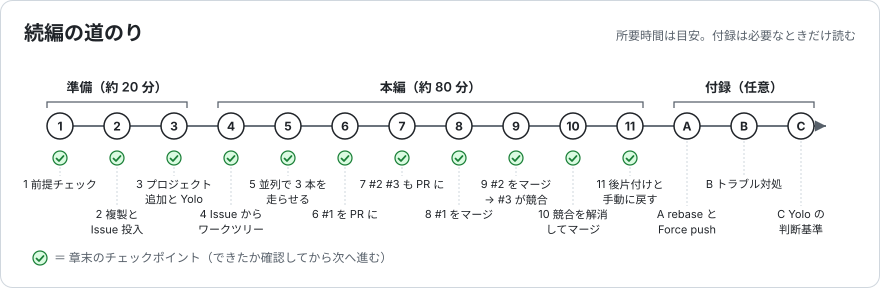

本編で体験する流れを 1 枚にすると次のようになります。**3 つの Issue を 3 本のワークツリーで進め、PR を 3 本作り、順にマージします。3 本目で競合が起きます。**

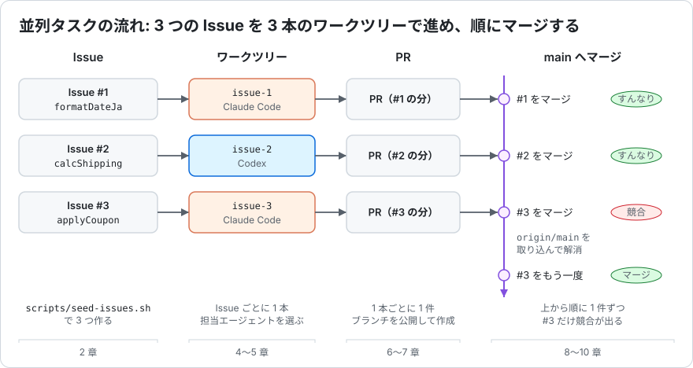

### 第1弾との違い

| | 第1弾 | 続編 |
|---|---|---|
| タスク | 同じバグ修正を Claude Code と Codex で競争 | 別々の機能追加を 3 本並列（#1 Claude Code、#2 Codex、#3 Claude Code） |
| ワークツリーの作り方 | 「名前」タブに名前を打つ | 「GitHub」タブで **Issue を選ぶ**。名前もブランチ名も Issue から自動で付く |
| エージェントへの指示 | 指示文を貼る | **Issue の URL が最初から入力欄に入っている**。その後ろに一言添えるだけ |
| 権限 | 手動（毎回確認する） | **Yolo**（確認なし。練習リポなので解禁し、終わったら戻す） |
| PR | 作るまで | チェック確認 → **マージ** → **コンフリクト解消** → Issue が閉じるまで |

### 用語（先に押さえておく）

| 用語 | 意味 |
|---|---|
| Issue | GitHub 上のタスク票。今回はこれが「仕様書」です。`#1` のように番号で呼びます |
| チェック（Checks） | PR に対して自動で走るテストなど。今回は GitHub Actions が `npm test` を実行し、結果が PR に ✓ / ✗ で付きます |
| マージ（Merge） | PR のブランチの変更を `main` に取り込むこと。今回は Orca の PR パネルから行います |
| コンフリクト（競合、Conflict） | 2 つのブランチが **同じファイルの同じ場所** を別々に変えたため、git が自動で合成できない状態 |
| 分岐元（base、`origin/main`） | ワークツリーを切ったときの元。他の PR がマージされると `origin/main` が先に進み、自分のブランチが「古く」なります |

Issue と PR は **番号を共有** します。今回は Issue が #1〜#3 なので、PR は #4 から始まります。

---

## 1. 前提チェック（5 分）

第1弾の 1〜3 章が済んでいる（Orca がインストール済みで、「連携」の GitHub が Connected）ことを前提にします。ターミナルで次を確認してください。

```bash
claude --version      # 2.x
codex --version       # codex-cli 0.15x
node --version        # v20 以上
gh auth status        # "Logged in to github.com account <あなたのID>" が出れば OK
```

Orca のバージョンは、メニューバーの **Orca → Orca について**（About Orca）で確認できます。1.4.200 前後なら本書の表記と合うはずです。

✅ **ここまでできたら**: 4 つのコマンドが全部エラーなく終わり、Orca が起動している。

---

## 2. サンプルリポジトリを複製して、Issue を作る（10 分）

### 2-1. テンプレートから複製する

第1弾と同じ要領で、続編のテンプレートリポジトリから **自分のアカウントに** 複製を作ります。

```bash
cd ~/Documents            # 第1弾と同じ場所に置く前提で書きます
gh repo create orca-handson-2 --template misshii3/orca-handson-2 --private --clone
cd orca-handson-2
npm test
```

今回は **9 件すべて成功** するのが正常です（第1弾のバグは直してあります）。

```
ℹ tests 9
ℹ suites 3
ℹ pass 9
ℹ fail 0
```

### 2-2. タスク用の Issue を 3 件作る

テンプレートを複製しても **Issue はコピーされません**。同梱のスクリプトで、自分のリポジトリに Issue を作ります。

```bash
bash scripts/seed-issues.sh
```

次のように 3 件作られ、最後に一覧が出ます。

```
対象リポジトリ: <あなたのID>/orca-handson-2

作成しました: formatDateJa を追加する（日付を「2026年9月13日」形式にする）
  https://github.com/<あなたのID>/orca-handson-2/issues/1
作成しました: calcShipping を追加する（送料計算。3,000 円以上で送料無料）
  https://github.com/<あなたのID>/orca-handson-2/issues/2
作成しました: applyCoupon を追加する（クーポンコードで割引する）
  https://github.com/<あなたのID>/orca-handson-2/issues/3

現在の Issue:
3  OPEN  applyCoupon を追加する（クーポンコードで割引する）  ...
2  OPEN  calcShipping を追加する（送料計算。3,000 円以上で送料無料）  ...
1  OPEN  formatDateJa を追加する（日付を「2026年9月13日」形式にする）  ...
```

スクリプトの中身は `issues/*.md` を番号順に読み、1 行目をタイトル、2 行目以降を本文にして `gh issue create` を呼んでいるだけです。同じタイトルの Issue があれば作らないので、何度実行しても増えません。

### 2-3. Issue を読む（3 分）

ブラウザで `https://github.com/<あなたのID>/orca-handson-2/issues` を開き、3 つの Issue を **自分で一度読んでください**。それぞれ「背景 / 仕様 / 受け入れ条件」の形で書かれています。

| # | 追加する関数 | 触るファイル | 担当させるエージェント |
|---|---|---|---|
| 1 | `formatDateJa` … 日付を「2026年9月13日」形式に | `src/date.js`, `test/date.test.js` | Claude Code |
| 2 | `calcShipping` … 送料。3,000 円以上で無料 | `src/price.js`, `test/price.test.js` | Codex |
| 3 | `applyCoupon` … クーポンコードで割引 | `src/price.js`, `test/price.test.js` | Claude Code |

#2 と #3 が **同じ 2 ファイル** を触ることに注目してください。どちらも `src/price.js` 冒頭の「定数ブロック」に定数を足し、末尾に関数を足し、`test/price.test.js` の末尾にテストを足します。これが 9〜10 章のコンフリクトの種です。

> `.github/workflows/test.yml` も一緒に複製されています。これは GitHub Actions の設定で、PR を作ると `npm test` が GitHub 上で実行され、結果が PR に付きます（8 章で見ます）。複製直後にも `main` に対して 1 回走ります。

✅ **ここまでできたら**: 自分の GitHub に `orca-handson-2` があり、Issue が #1〜#3 の 3 件 open、ローカルで `npm test` が 9 件成功。

---

## 3. Orca にプロジェクトを追加して、Yolo に切り替える（5 分）

### 3-1. プロジェクトを追加する

Orca で、サイドバーの「プロジェクト」右側の **＋**（または「作成」メニュー → 「プロジェクトを追加」）→ 「**フォルダーを参照**」で `~/Documents/orca-handson-2` を選びます（第1弾 5 章と同じ操作です）。
サイドバーに `orca-handson-2` → `main ［プライマリ］` が出ます。

### 3-2. 「Agent の権限」を Yolo にする

第1弾では「Agent の権限」を **手動** にして、エージェントの確認プロンプトを読む練習をしました。続編では **3 本のエージェントを同時に走らせる** ので、手動だと確認プロンプトの応対で手一杯になります。
そこで今回は、第1弾の付録 C に書いた「Yolo を使ってよい条件」を **この練習リポジトリが満たしていることを確認した上で**、Yolo を使います。

- [ ] 業務リポジトリではなく、**練習用の使い捨て** リポジトリである（`orca-handson-2` は自分のアカウントの private リポ）
- [ ] このリポジトリから届く範囲に、本番の認証情報や `.env` が **ない**（サンプルには何も入っていません。`~/Documents` 直下などに秘密情報を置いていないかは自分で確認）
- [ ] `git push --force` や `rm -rf` のような取り消せない操作をエージェントがしても **困らない**（壊れたら複製し直せばよい）
- [ ] 終わったら **差分を全部読む**（Yolo の代償です。6〜7 章で必ず読みます）

4 つとも ✓ なら、設定（⌘,）→ 「**Agent**」→ 「**Agent の権限**」を **Yolo** にします。「インストール済み」の欄が `claude --dangerously-skip-permissions`、`codex --dangerously-bypass-approvals-and-sandbox` に変わります（第1弾 3 章の逆の操作です）。

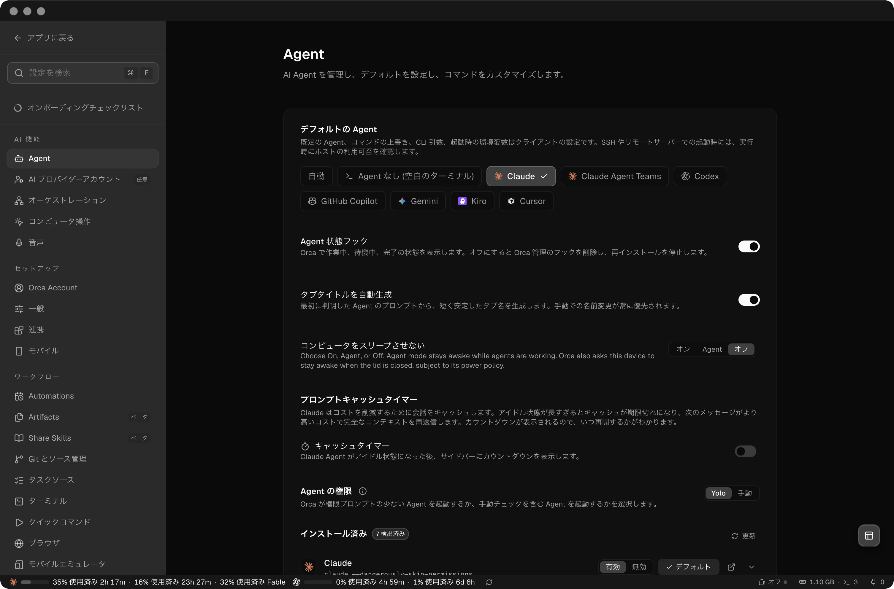

権限の 3 層の図を再掲します。今変えたのは 1 層目だけで、Yolo にすると 2 層目（エージェント自身の確認）も **フラグで丸ごとスキップ** されます。3 層目（macOS のフォルダアクセス）はそのままです。


> **11 章で必ず手動に戻します。** 業務で Orca を使うときの既定は手動、と考えてください。

✅ **ここまでできたら**: サイドバーに `orca-handson-2` → `main ［プライマリ］`、「Agent の権限」が **Yolo**。

---

## 4. Issue からワークツリーを 3 本作る（10 分）

> 4〜7 章が本編の前半です。第1弾では「名前」タブで名前を打ってワークツリーを作りましたが、今回は **Issue から** 作ります。

### 4-1. #1 のワークツリー（Claude Code）

サイドバーで `orca-handson-2` をクリックして選び、**⌘N** を押します。「ワークツリーを作成する」ダイアログが開きます。

| 項目 | 入れる値 |
|---|---|
| プロジェクト | `orca-handson-2` になっているか確認。**別のプロジェクトを最後に触っていると、そちらが入っていることがあります。** 右の灰色の文字が `<あなたのID>/orca-handson-2` でなければ、ドロップダウンで選び直す |
| 実行先 | `Local Mac` のまま |
| タブ | 「**GitHub**」に切り替える（既定は「スマート」） |
| Agent | **Claude** |
| 詳細設定 | 触らない |

「GitHub」タブに切り替えると、入力欄の下にこのリポジトリの Issue と PR の一覧が出ます。**新しいものが上** なので、#3、#2、#1 の順に並んでいます。

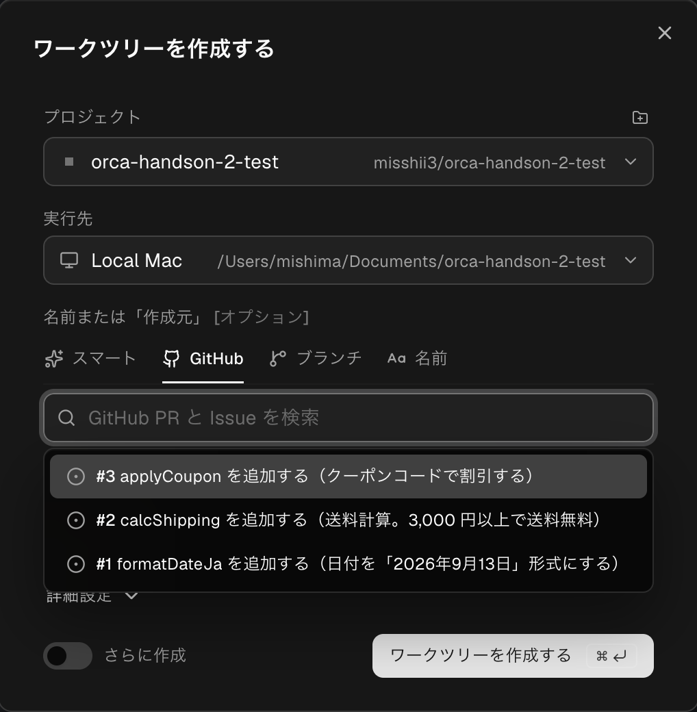

一番下の **#1 formatDateJa を追加する** をクリックします。入力欄が Issue のチップに変わり、右に「ブラウザでリンクを開く」と「選択したソースをクリアする（×）」のアイコンが付きます。

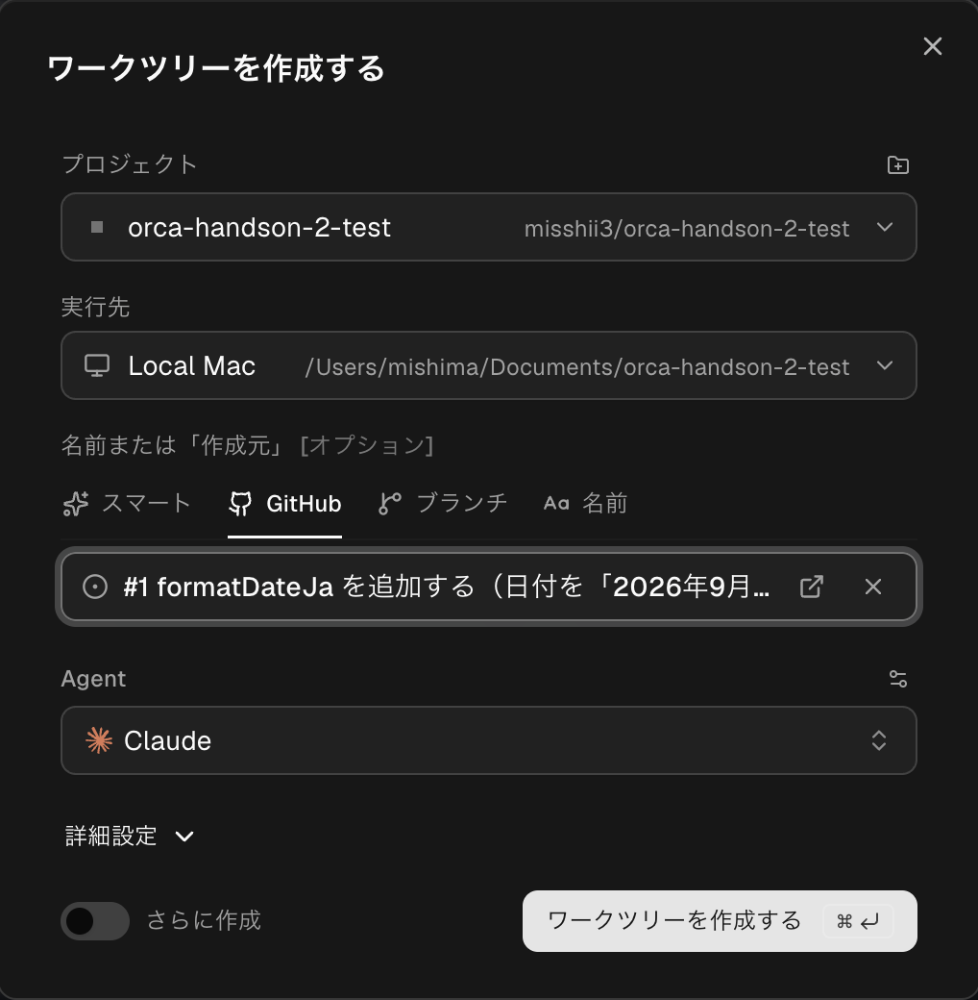

「詳細設定」を開くと、**名前が Issue のタイトルから自動で作られている** のが見えます（例: `formatdateja-2026-9-13`。英数字と数字だけが残ります）。ブランチ名は `<あなたのID>/formatdateja-2026-9-13` になります。ここは見るだけで、変えずに閉じて構いません。

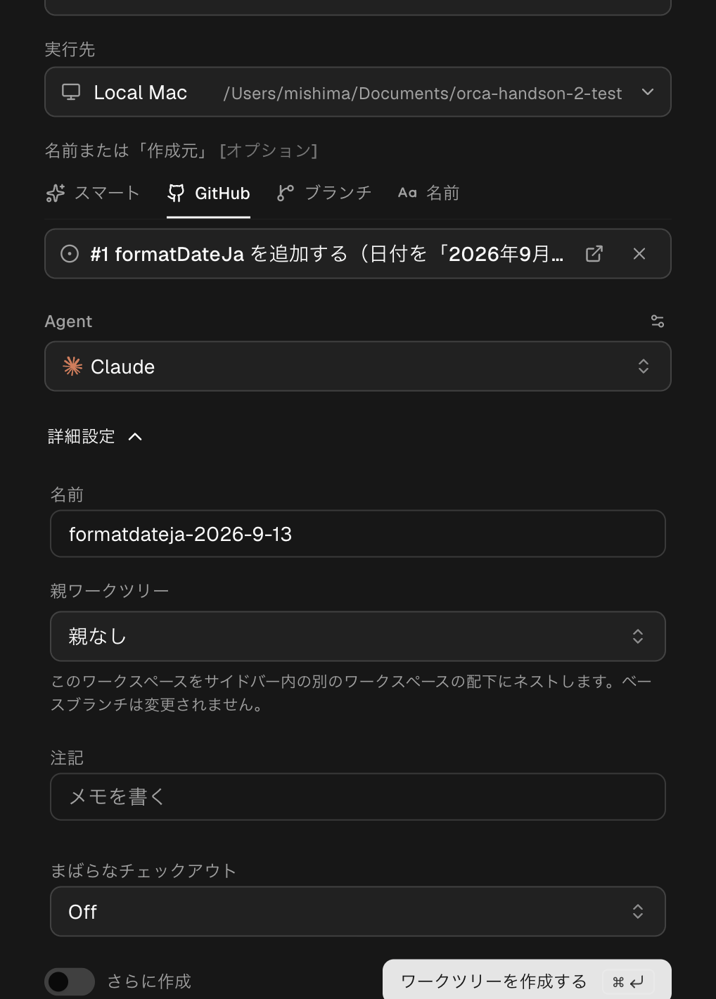

> 「**スマート**」タブでも同じことができます。入力欄に `#1` や Issue の URL を貼ると候補が出ます。「GitHub」タブは一覧から選ぶ、「スマート」タブは検索して選ぶ、という違いです。

「**ワークツリーを作成する ⌘↩**」を押します。

### 4-2. 作成直後に起きること

- サイドバーに新しいワークツリーのカードが出ます。**カードの名前は Issue のタイトル**、その下にブランチ名、右端に Issue へのリンクアイコンが付きます
- 第1弾と同じ「セットアップスクリプトを追加する」のポップアップが出たら × で閉じます（依存パッケージはありません）
- 中央のターミナルは **数秒だけ `zsh` のプロンプト** のままで、その後に自動で次のコマンドが流れます

```
claude '--dangerously-skip-permissions' --prefill 'https://github.com/<あなたのID>/orca-handson-2/issues/1'
```

`--dangerously-skip-permissions` が 3 章で Yolo にした効果、`--prefill '<Issue の URL>'` が **Issue から作ったワークツリーの効果** です。Orca は Issue の URL をエージェントの入力欄に **あらかじめ入れて** 起動します。

### 4-3. Claude Code の起動画面

Claude Code は起動時に、状況に応じて次の画面を出します。出た順に答えてください。

1. **Quick safety check**（フォルダを信頼するか）… 第1弾と同じです。↓ で「**Yes, I trust this folder**」を選んで ↩。このリポジトリで最初のワークツリーだけに出て、2 本目以降は出ません
2. **Bypass Permissions mode の警告** … `--dangerously-skip-permissions` 付きで初めて起動したときに出ます。内容（信頼できる隔離環境でだけ使うこと）を読んで「**Yes, I accept**」を選んで ↩。一度承諾すると次からは出ません

プロンプトが出ると、入力欄には Issue の URL が入っていて、その下に **「⚠ Pre-filled prompt · review before pressing Enter」** と表示されます。「入力欄に文が入っているから、送る前に確認して」という Claude Code からの注意です。**まだ ↩ は押しません**（5 章で 3 本まとめて送ります）。一番下の行に `bypass permissions on` と出ているのが Yolo の印です。

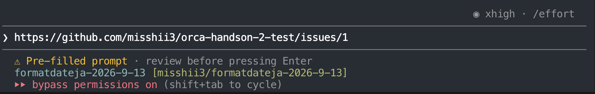

### 4-4. #2（Codex）と #3（Claude Code）のワークツリー

同じ操作を 2 回繰り返します。プロジェクトは今度は最初から `orca-handson-2` になっているはずです。

| | 「GitHub」タブで選ぶ Issue | Agent |
|---|---|---|
| 2 本目 | **#2 calcShipping を追加する** | ドロップダウンから **Codex** |
| 3 本目 | **#3 applyCoupon を追加する** | **Claude** |

Agent のドロップダウンには「ブランクターミナル / Claude / Claude Agent Teams / Codex / GitHub Copilot / Gemini / Kiro / Cursor」が並びます。Codex は `codex '--dangerously-bypass-approvals-and-sandbox'` で起動し、起動画面に `permissions: YOLO mode` と出ます。Codex の入力欄（`»`）にも Issue の URL が入っています。

ブランチ名の例: `<ID>/calcshipping-3-000`、`<ID>/applycoupon`（Issue タイトルから作られるので、数字が入ったり入らなかったりします）。

> **なぜ #2 だけ Codex なのか**: 担当の割り振りは「どのエージェントが得意か」ではなく **タスクごとに好きに選べる** ことを見せるためです。#3 を Claude Code にしたのは、10 章のコンフリクト解消という重めの作業を任せるためです。

✅ **ここまでできたら**: サイドバーに 3 本のワークツリー（カード名が Issue のタイトル）が並び、3 つのターミナルの入力欄に Issue の URL が入って待っている。

---

## 5. 3 本を並列で走らせる（15 分）

### 5-1. URL の後ろに一言添えて送る

各ワークツリーのターミナルで、入力欄の **URL の後ろにスペースを 1 つ入れて**、次の文を貼り付けてから ↩ します（3 本とも同じ文で構いません）。

```
この Issue を読み、受け入れ条件をすべて満たすように実装してください。実装が終わったら npm test を実行してすべて成功することを確認し、何をどう実装したかを日本語で簡潔に報告してください。
```

URL だけで ↩ しても動きますが、「テストを回す」「日本語で報告する」を添えると、5-3 で読む報告がそろいます。

Yolo なので、エージェントが Issue を読みに行っても、ファイルを書き換えても、`npm test` を走らせても **確認は出ません**。第1弾で読んでいた確認プロンプトの中身を、今回は **差分で後から読む** ことになります。

> ワークツリーの切り替えは **⌘J** でワークツリー名の一部（`coupon` など）を打つのが速いです（第1弾 8 章）。3 本並べて眺めたいときは ⌘J → Shift+↩ で分割ペインに開けます（第1弾 7-3）。

### 5-2. 待っている間に見るもの

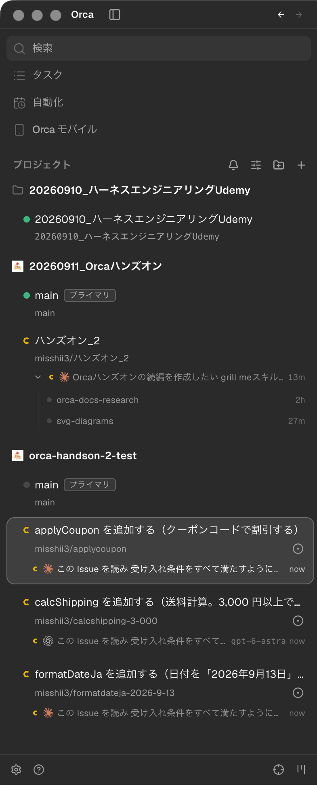

- サイドバーのアイコンで進み具合が分かります（スピナー = 作業中、ベル = あなたの番、緑のチェック = 完了。一覧は第1弾 7-4）
- カードの下の行に、最初の指示文の冒頭とエージェント名（Codex は `gpt-…` のモデル名）が出ます
- 参考値: 今回の実測では 3 本とも **40 秒〜1 分半** で完走しました。順番は毎回変わります

### 5-3. 完了したら報告を読む

3 本とも緑のチェック（またはベル）になったら、各ターミナルの日本語の報告を読みます。

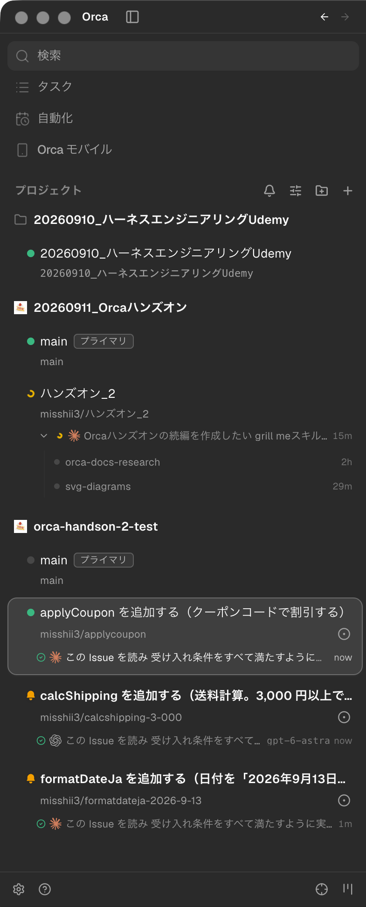

見るのは次の 2 点です。

- Issue の **受け入れ条件を 1 つずつ満たしたと言っているか**（定数を定数ブロックに置いたか、テストを末尾に足したか、既存を触っていないか）
- `npm test` の結果に **fail 0** と書いてあるか。参考値: #1 は 12 件、#2 は 13 件、#3 は 15 件になります（元の 9 件 + それぞれ 3、4、6 件）

報告を読んだだけで信じないでください。次の章で差分を自分の目で読みます。

> Claude Code の入力欄に、灰色で「コミットして PR を作成してください」のような **提案文** が出ることがあります。Claude Code が次の一手を提案する機能です。今回は Orca の Source Control から PR を作る練習なので、**この提案はそのまま ↩ しないでください**（入力欄をクリックして自分の文を打てば消えます）。

✅ **ここまでできたら**: 3 本のワークツリーが完了し、各ターミナルに日本語の報告があり、どれも fail 0。

---

## 6. #1 を PR にする（10 分）

ここは第1弾 9〜11 章の復習です。違いは **コミットメッセージに `Closes #1` を書く** ことだけです。

### 6-1. 差分を読む

サイドバー（または ⌘J）で **#1 のワークツリー**（formatDateJa）を選び、右パネルの **Source Control**（3 番目のブランチアイコン）を開きます。「変更点 2」に `date.js` と `date.test.js` が並んでいます。

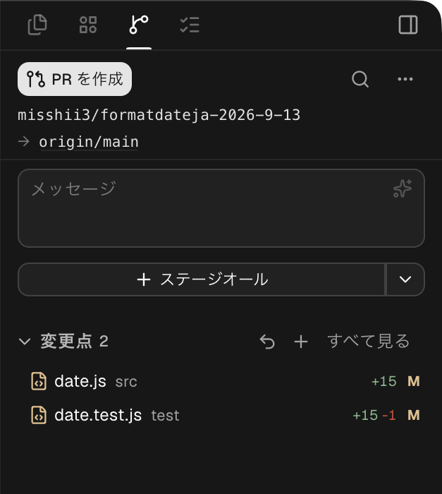

「**すべて見る**」で Changes を開き、第1弾と同じ 3 つの観点で読みます。

- [ ] **仕様どおりか**: Issue の表の 3 例（`2026年9月13日`、`2026年1月5日`、`2026年12月25日`）がテストに入っているか。ゼロ埋めしていないか
- [ ] **余計なことをしていないか**: 変更ファイルが `src/date.js` と `test/date.test.js` の 2 つだけか。既存の `formatDate` とそのテストは触っていないか（`import` 行に関数名が 1 つ増えるのは正常です）
- [ ] **読めるか**: JSDoc が日本語で付いているか

気になる行があれば、第1弾 10 章の **Annotate**（行の ＋ → メモ → Send）でエージェントに直させてから先へ進んでください。問題なければ次へ。

### 6-2. コミットする（`Closes #1` を付ける）

Source Control で「**＋ ステージオール**」を押すと、見出しが「ステージ済みの変更 2」になり、メッセージ欄が有効になります。メッセージ欄右上の **AI アイコン** でコミットメッセージを生成します（10〜20 秒。英語で出ることもあります）。**生成された文を読んで、事実と違えば直してください**。

そのうえで、メッセージの **末尾に 1 行空けて** 次を追記します。

```
Closes #1
```

`Closes #N`（`Fixes #N`、`Resolves #N` でも同じ）は GitHub のキーワードで、**このコミットが `main` に入った時点で Issue #N が自動的に閉じます**。PR の本文に書いても同じ効果があります。今回は Orca が PR の本文を空で作るので、コミットメッセージに書くのが確実です。

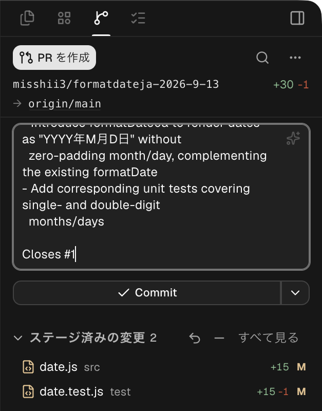

「**✓ Commit**」を押します（メッセージ欄で ⌘↩ でも可）。

### 6-3. push して PR を作る

コミットすると、ボタンが「**ブランチを公開**」（Publish Branch）に変わり、右上に `↑1` が出ます。押して push します。

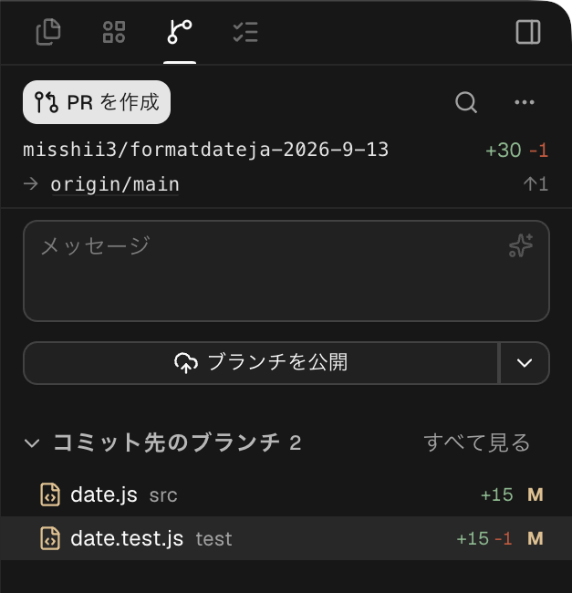

push が終わったら、パネル上部の「**PR を作成**」を押します。第1弾と同じく確認ダイアログなしで PR ができ、右パネルが自動で **PR パネル**（4 番目のアイコン）に切り替わります。

- 上部に **#4 OPEN**（PR の番号は Issue と共有なので 4 から始まります）
- タイトルはブランチ名から（例: `Formatdateja 2026 9 13`）、本文は空
- 緑の「**Create merge commit**」ボタン（**まだ押しません**。8 章で押します）
- 「**1 保留中**」の下に `test` が **Queued** または **In progress**。GitHub Actions が動き始めた印です

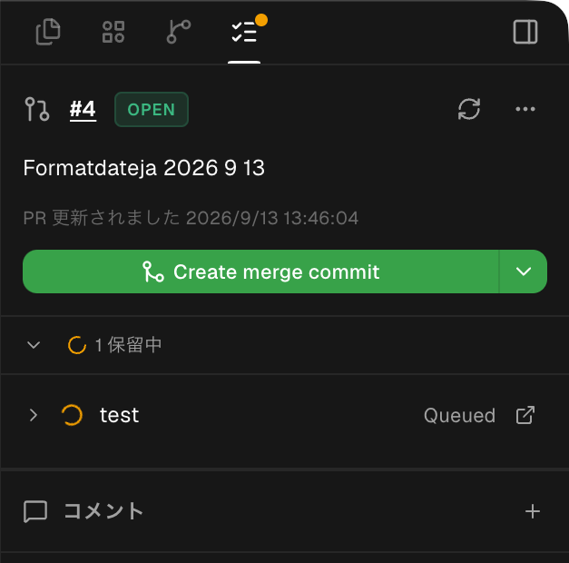

✅ **ここまでできたら**: #1 の PR（#4）が OPEN で、PR パネルにチェック `test` が出ている。

---

## 7. #2 と #3 も PR にする（10 分）

#2（Codex）と #3（Claude Code）のワークツリーで、6 章と同じ手順を繰り返します。

| | 差分で特に見る点 | コミットメッセージの末尾 |
|---|---|---|
| #2 | 定数ブロックに `SHIPPING_FEE`, `FREE_SHIPPING_THRESHOLD` が **`export const` で** 足されているか。`calcShipping(3000)` が `0` になるテストがあるか（境界値） | `Closes #2` |
| #3 | 定数ブロックに `COUPONS` が足されているか。`applyCoupon(300, "SAVE500")` が `0` になるテスト（0 未満にしない）と、`code` 省略時のテストがあるか | `Closes #3` |

第1弾で見たように、Codex は最小差分、Claude Code はコメント多め、と **書き方に差** が出ます。今回は 2 本を比べて選ぶのではなく、**両方をマージします**。だからこそ、次の章で「同じ場所を別々に書いた」ことがコンフリクトになります。

3 本の PR ができたら、ターミナルで確認します。

```bash
cd ~/Documents/orca-handson-2
gh pr list
```

#4、#5、#6 の 3 行が出れば OK です。この時点では **どの PR も競合していません**。3 本とも同じ `main` から分岐していて、`main` はまだ動いていないからです。

✅ **ここまでできたら**: `gh pr list` に PR が 3 本、サイドバーの 3 本のワークツリーに PR アイコンが付いている。

---

## 8. #1 をマージする（5 分）

> 8〜10 章が本編の後半です。ここから **`main` が動き始めます**。

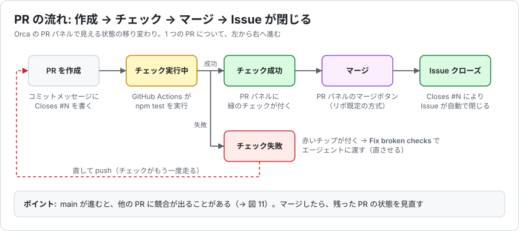

### 8-1. チェックが緑になるのを待つ

#1 のワークツリーを選び、右パネルの **PR**（4 番目のアイコン）を開きます。表示が古いときは、PR 番号の右にある **更新アイコン**（回転矢印）を押してください。

「保留中」が「**合格**」に変わり、`test` が **Successful**（緑の ✓）になれば準備完了です。まだ黄色なら数十秒待ちます（参考値: `npm test` だけなので 10〜60 秒）。

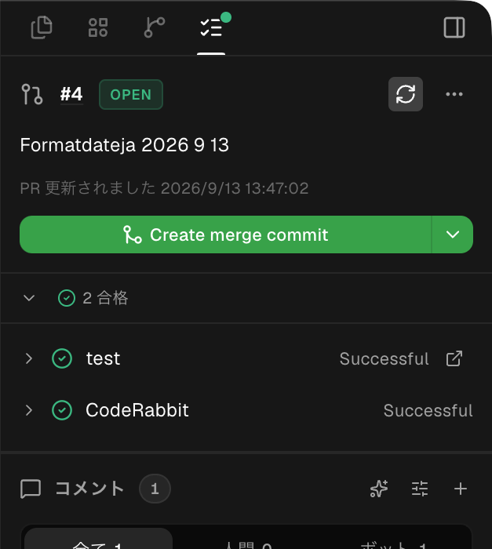

> 画像に写っている `CodeRabbit` は筆者のアカウントに入っているレビューボットで、参加者の環境には出ません。`test` の 1 行だけが出れば正常です。

赤い ✗ になったら、チェック名をクリックすると失敗したジョブのログがその場で読めます。ワークツリーのカードにも赤いチップが付き、PR ビューの「**Fix broken checks**」を押すと、失敗したチェック名とリンクをエージェントに渡して直させることができます（付録 B）。

### 8-2. マージする

緑の「**Create merge commit**」を押します。**確認ダイアログは出ず、数秒でマージされます。** ボタンの文言は **リポジトリの既定のマージ方式** に従い、`Create merge commit` / `Squash and merge` / `Rebase and merge` のどれかです。複製直後のリポジトリは `Create merge commit` です。

PR の状態が **MERGED** に変わり、ボタンの位置には「**ワークスペースの削除**」が現れます（11 章で使います。今は押しません）。

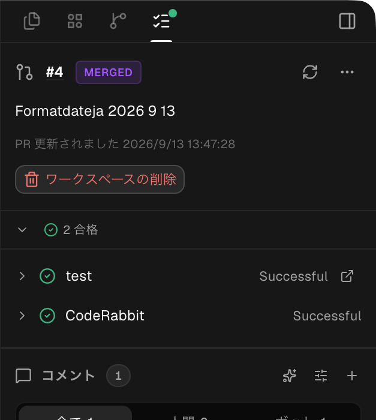

### 8-3. Issue が閉じたことを確認する

```bash
gh issue view 1
```

`state: CLOSED` と出ます。6-2 で書いた `Closes #1` が効いた結果です。ブラウザで Issue #1 を開くと、コミットへのリンクと一緒に「closed」になっています。

✅ **ここまでできたら**: PR #4 が MERGED、Issue #1 が CLOSED。

---

## 9. #2 をマージすると、#3 が競合する（5 分）

### 9-1. #2 をマージする

#2 のワークツリーを選び、8 章と同じ手順でマージします（チェックが緑 → Create merge commit）。#1 は `date.js` だけ、#2 は `price.js` だけを触っているので、**すんなり** 入ります。`gh issue view 2` が CLOSED になります。

### 9-2. #3 の PR を見る

**マージ直後に #3 のワークツリーに切り替えて、PR パネルの更新アイコンを押してください。** さっきまで緑だった #3 の PR が、次のように変わります。

- 緑のボタンが灰色の「**競合**」になり、押せない
- 「**競合によりこれがブロックされます PR**」「チェックとマージが完了する前に競合を解決してください。」という警告と、「**解決**」ボタン
- 「**4 commits 遅れ**（ベースコミット: …）」… `main` が 4 コミット先に進んだ、という意味
- 「**競合するファイル**」に `src/price.js` と `test/price.test.js`

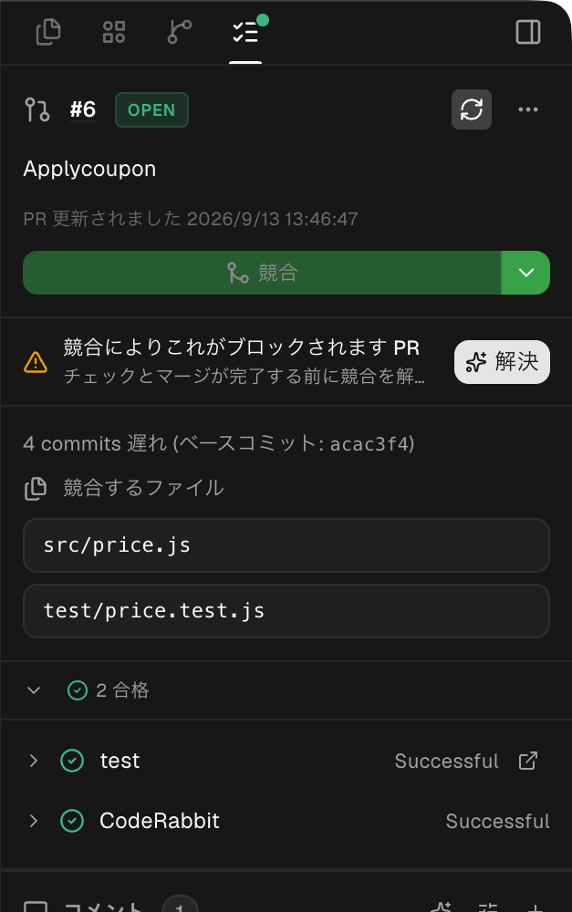

GitHub が `main` の新しい状態と #3 のブランチを合成しようとして、できなかったのです。何が起きたのかを図にします。

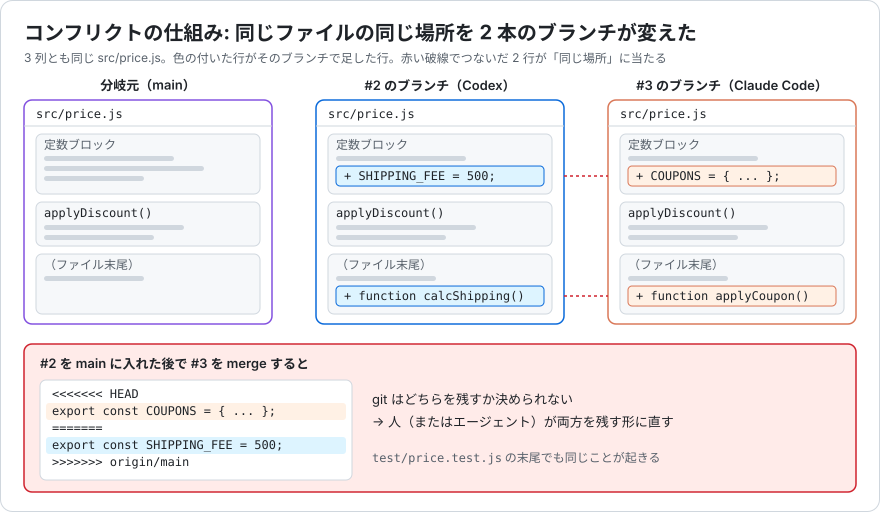

- #2 と #3 は同じ `main` から分岐し、どちらも `src/price.js` の **定数ブロック** に定数を足し、**末尾** に関数を足し、`test/price.test.js` の **import 行** と **末尾** にテストを足した
- #2 が `main` に入った
- #3 のブランチを `main` に合成しようとすると、同じ場所に **違う行** が足されている。git は「両方残す」のか「片方だけ」なのか判断できないので、人に決めさせる

これが **コンフリクト（競合）** です。日常業務では、複数人・複数エージェントが並列で動いている限り必ず起きます。次の章で解消します。

✅ **ここまでできたら**: PR #5 が MERGED、Issue #2 が CLOSED、PR #6 のパネルに「競合」の表示。

---

## 10. #3 の競合を解消してマージする（15 分）

競合の解消は、**#3 のワークツリーの中で `main` を取り込み、ぶつかった箇所を直して、コミットして push する** 作業です。取り込みには `merge` と `rebase` の 2 通りがあり、今回は **`merge`** を使います（`rebase` は付録 A）。`merge` なら force push が要らないからです。

> PR パネルの「**解決**」ボタンと、次に出てくる Source Control の「**AIで解決する**」ボタンは、この作業をまとめてエージェントに任せる入口です。ただし **本書の検証（1.4.200）では、押すと新しいタブが開くだけでエージェントが起動しませんでした。** そのため本書では、取り込みは自分で打ち、解消はワークツリーで動いている Claude Code に直接頼みます。ボタンが動く環境なら、同じことが自動で進みます（付録 B）。押すと次のダイアログ（使う Agent とプロンプトの確認）が出るので、見かけたら「これのことか」と分かる程度に覚えておいてください。
>
> 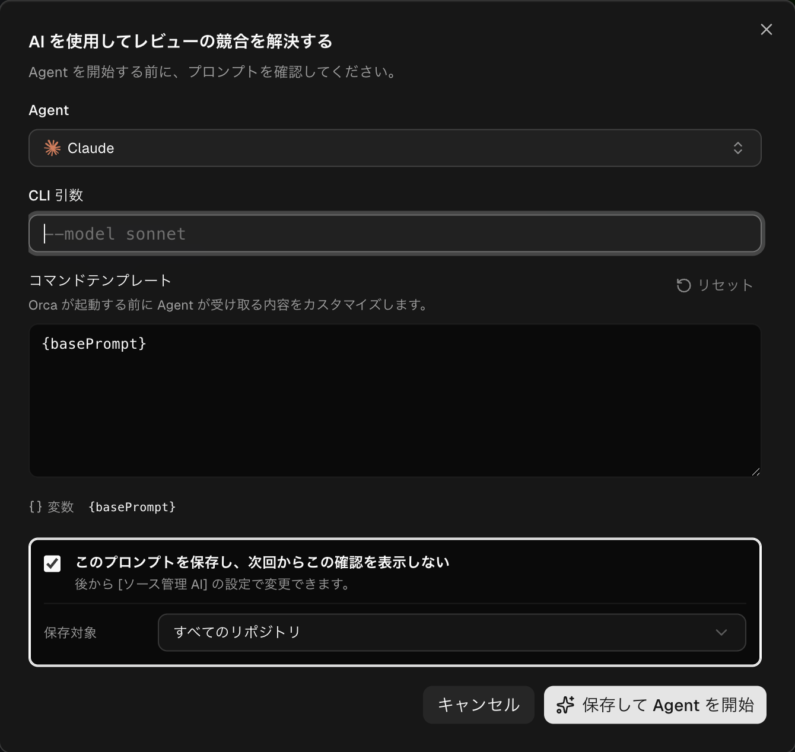

### 10-1. ターミナルで `origin/main` を取り込む

#3 のワークツリーで、エージェントのターミナルとは別に **ブランクターミナル** を開きます（中央のタブバーの **＋** → 「ブランクターミナル」。ワークツリーのディレクトリで開きます）。次を実行します。

```bash
git fetch origin && git merge origin/main
```

次のような出力が出ます。

```
Auto-merging src/price.js
CONFLICT (content): Merge conflict in src/price.js
Auto-merging test/price.test.js
CONFLICT (content): Merge conflict in test/price.test.js
Automatic merge failed; fix conflicts and then commit the result.
```

`CONFLICT` が 2 ファイルに出ました。この状態でファイルを開くと、ぶつかった箇所が `<<<<<<<`、`=======`、`>>>>>>>` の印（コンフリクトマーカー）で囲まれています。

同時に Orca の表示も変わります。サイドバーのカードに **Merging** のバッジが付き、Source Control パネルが競合モードになります。

- 「**Merge conflicts: 2 は未解決です**」の警告と、「**AIで解決する**」「**競合をレビューする**」「**マージを中止する**」の 3 ボタン
- 「**競合 2**」に `price.js` と `price.test.js`（「双方で変更」「未解決」）
- 「ステージ済みの変更 2」に `date.js` と `date.test.js` … #1 の変更は競合せず、git が自動で取り込んでステージ済みにしたもの

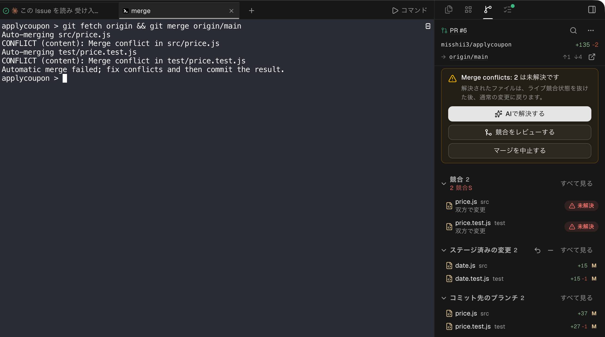

> ここでやめたくなったら「**マージを中止する**」（ターミナルなら `git merge --abort`）で取り込み前に戻れます。

### 10-2. 競合の中身を見る（競合をレビューする）

「**競合をレビューする**」を押すと、中央に **Conflict Review** タブが開きます。左にファイル一覧（未解決の印付き）、右にコンフリクトマーカーを色分けしたエディタが出て、「前の競合 / 次の競合」で移動できます。**直す前に、何と何がぶつかっているのかを自分の目で見ておいてください。**

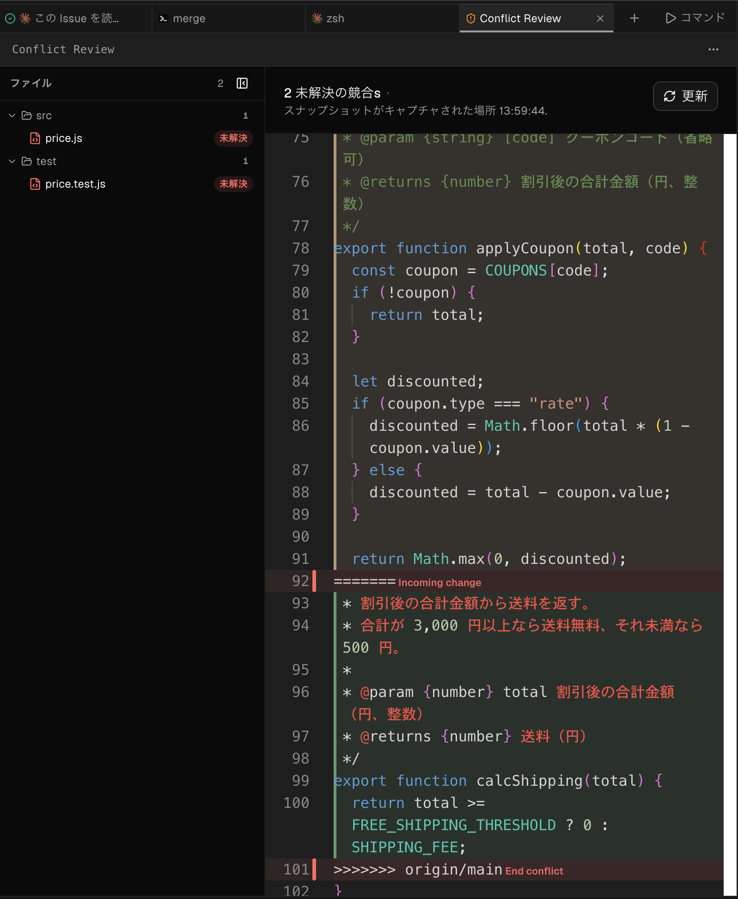

上の画像では、`=======` の上が自分のブランチ（`applyCoupon`）、下が `origin/main` から来た `calcShipping` です。今回の正解は **「両方残す」** です。定数ブロックには `SHIPPING_FEE` / `FREE_SHIPPING_THRESHOLD` と `COUPONS` の両方、末尾には `calcShipping` と `applyCoupon` の両方、テストにも両方の `describe` と `import` が並ぶ形になります。

### 10-3. Claude Code に解消させる

#3 のワークツリーの **Claude Code のターミナル**（Issue を実装したのと同じセッション）に戻り、次を貼って ↩ します。

```
いま git merge origin/main の途中で、src/price.js と test/price.test.js がコンフリクトしています。git status と git diff で状況を確認し、両方の変更（origin/main 側の calcShipping と関連する定数・テスト、こちらの applyCoupon と COUPONS・テスト）をすべて残す形でコンフリクトを解消してください。コンフリクトマーカーが 1 つも残っていないことを確認し、npm test がすべて成功することを確かめてください。git add まではしてよいですが、コミットはしないでください。最後に、どの箇所をどう統合したかを日本語で簡潔に報告してください。
```

参考値: 今回の実測では約 1 分 15 秒で完了し、「定数ブロック、末尾の関数、テストの import と末尾、の 4 か所を両方残す形で統合した」という報告が返ってきました。

### 10-4. 解消結果を検品する

Conflict Review タブの「**更新**」を押すと「**すべての競合が解決されました**」に変わります。Source Control は「**Merge in progress**」と「マージを中止する」だけの表示になり、「ステージ済みの変更 4」に 4 ファイルが並びます。

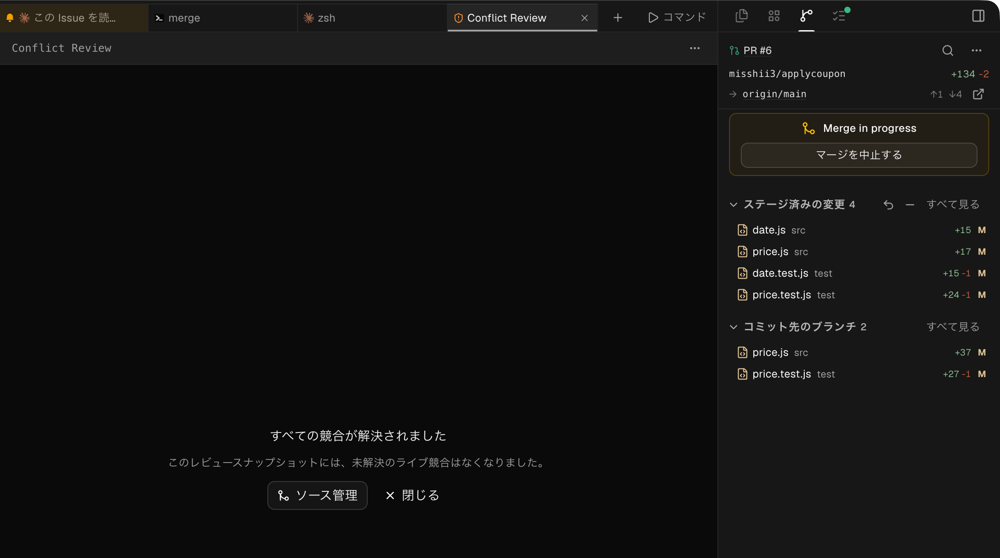

「ステージ済みの変更」の `price.js` を開いて、次を確認します。

- [ ] 定数ブロックに **6 つの定数**（元の 3 つ + `SHIPPING_FEE`, `FREE_SHIPPING_THRESHOLD` + `COUPONS`）が並んでいるか
- [ ] `calcShipping` と `applyCoupon` の **両方** が残っているか
- [ ] `test/price.test.js` に `calcShipping` と `applyCoupon` の **両方** の `describe` があり、`import` に 4 つの関数が並んでいるか
- [ ] コンフリクトマーカー（`<<<<<<<` など）が **1 つも残っていない** か

ブランクターミナルでテストも回します。

```bash
npm test
```

`fail 0` で、テスト数が増えていること（参考値: 9 + #1 の 3 + #2 の 4 + #3 の 6 = **22 件**。エージェントの書き方で多少変わります）を確認します。

### 10-5. マージコミットを作って push する

**マージ進行中は、Source Control にコミットメッセージ欄が出ません。** ブランクターミナルで git に用意されているメッセージのままコミットします。

```bash
git commit --no-edit
```

`Merge remote-tracking branch 'origin/main' into <ID>/applycoupon` というマージコミットができます。Source Control の表示が元に戻り、ボタンが「**プッシュ**」（Push）になっているので押します。`merge` で取り込んだので **force push は不要** です。

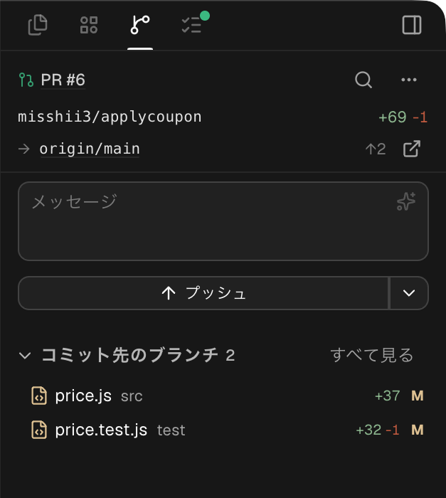

push すると #3 の PR でチェックが再実行されます。PR パネルの更新アイコンを押すと、競合の警告が消えて緑の「Create merge commit」が戻り、`test` が In progress になっています。

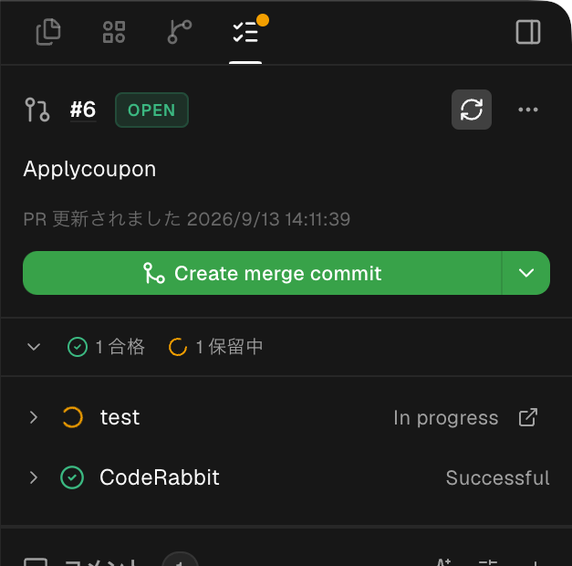

`test` が Successful になったら「**Create merge commit**」を押します。

```bash
gh issue view 3      # CLOSED
gh pr list           # 何も出ない（3 本ともマージ済み）
```

✅ **ここまでできたら**: PR #6 が MERGED、Issue #1〜#3 がすべて CLOSED、`gh pr list` が空。

---

## 11. 後片付けと、手動に戻す（10 分）

### 11-1. プライマリで結果を確かめる

3 本の PR が `main` に入りました。プライマリの `main` を最新にして、全部そろった状態のテストを回します。

```bash
cd ~/Documents/orca-handson-2
git pull
npm test
```

`fail 0` で、テスト数は 10-4 で見た数と同じになります。`src/price.js` を開いて、定数ブロックに 6 つの定数、関数が 4 つ（`calcTaxIncluded`, `applyDiscount`, `calcShipping`, `applyCoupon`）並んでいるのを見てください。

### 11-2. ワークツリーを 3 本削除する

消し方は 3 つあり、どれも同じ確認ダイアログが出ます。

1. マージ済みの PR パネルに出ている「**ワークスペースの削除**」ボタン（8-2 で見たもの）
2. サイドバーでカードを選んで **⌘⇧⌫**
3. カードを右クリック → 「削除 ⌘⇧⌫」（第1弾 12 章）

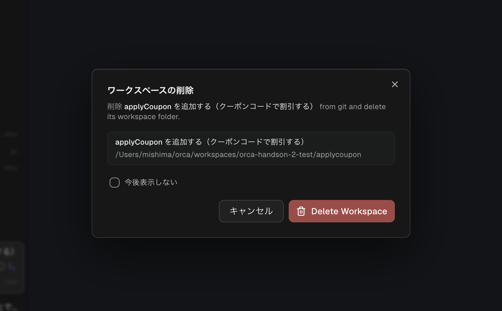

ダイアログにワークツリーの名前とフォルダのパスが出るので、**消す相手が正しいか読んでから**「**Delete Workspace**」を押します。3 本とも消します。

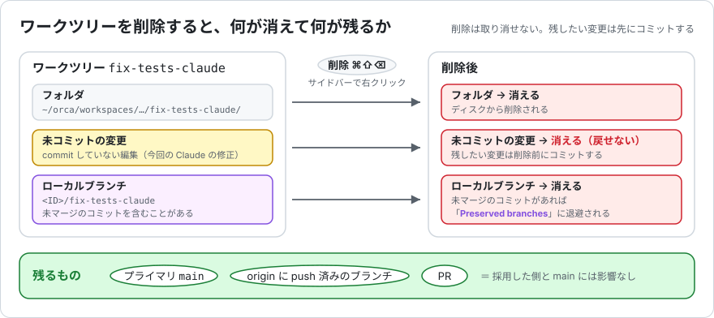

今回は 3 本とも **マージ済み** なので、ローカルブランチは黙って消えます。第1弾 12 章で触れた「コミット済みで未マージのブランチを退避する」動き（「Review N Branches」のトースト）は、**未マージのコミットがあるときだけ** 出ます。

```bash
git worktree list    # プライマリの 1 行だけ
git branch           # main だけ
```

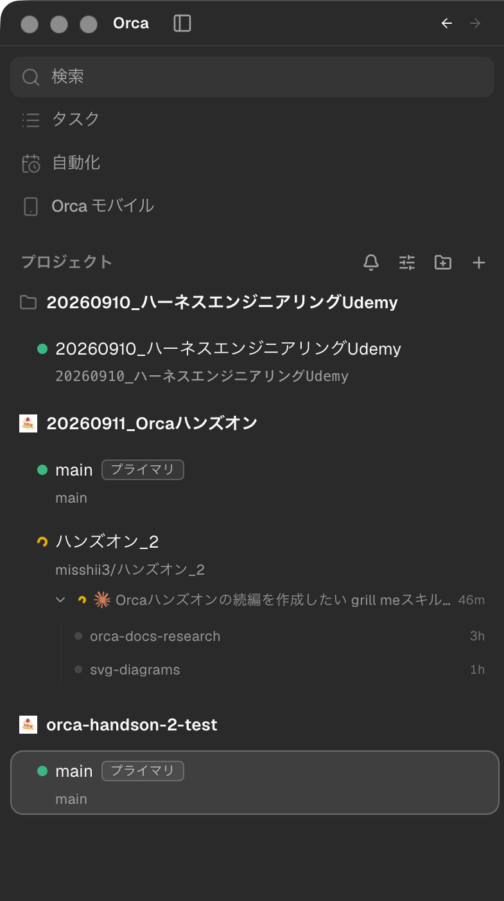

### 11-3. 「Agent の権限」を手動に戻す

設定（⌘,）→ 「**Agent**」→ 「**Agent の権限**」を **手動** に戻します。「インストール済み」が `claude`、`codex` だけになれば OK です。

Yolo を使った今回のリポジトリは使い捨てでした。業務のリポジトリでは、**手動を既定にし、Yolo にするなら 3-2 の 4 条件を毎回確かめる** のが続編で持ち帰ってほしい判断基準です（付録 C）。

### 11-4. Issue を確認する

```bash
gh issue list                    # 何も出ない
gh issue list --state closed     # 3 件
```

✅ **ここまでできたら**: サイドバーに `main` だけ、「Agent の権限」が **手動**、Issue が 3 件とも CLOSED。

ここまでで本編は終わりです。お疲れさまでした。

---

## 付録 A（任意）: `rebase` で取り込む場合と「Force push with lease」

10 章では `merge` で `origin/main` を取り込みました。チームによっては、履歴を一直線に保つために **`rebase`** を使うルールのところもあります。

```bash
git fetch origin
git rebase origin/main
# CONFLICT が出たら 10-3 と同じく Claude Code に解消させ（git add まで）、
git rebase --continue
```

`rebase` は **自分のブランチの履歴を書き換える** ので、すでに push 済みのブランチには普通の `push` ができません。このとき Orca の Source Control には「**Force push with lease**」が **別のボタンとして** 出ます。`--force-with-lease` は「リモートが自分の知っている状態のままなら上書きする」という安全弁付きの force push で、Orca は普通のプッシュの代わりに黙って force push することはありません。

ジュニアのうちは **`merge` を既定** にし、`rebase` + force push はチームのルールで求められたときだけ、意味を理解してから使ってください。

---

## 付録 B: トラブルシューティング

第1弾の付録 B（Orca 一般、`gh`、macOS の許可、PATH）も合わせて参照してください。ここには続編で新しく出る症状だけを載せます。

| 症状 | 見るところ・直し方 |
|---|---|
| `seed-issues.sh` が `gh にログインしていません` と言う | `gh auth login` を実行してから再実行 |
| `seed-issues.sh` が `not a git repository` や `no git remotes` と言う | `orca-handson-2` の中で実行しているか確認。`gh repo view` が自分のリポジトリを指しているか |
| Issue が重複して作られた | スクリプトはタイトル一致でスキップする。手で作った Issue とタイトルが違うと重複する。不要な方を `gh issue close N` で閉じる |
| 作成ダイアログのプロジェクトが別のリポになっている | 最後に触ったプロジェクトが入る。ドロップダウンで `orca-handson-2` を選ぶ |
| 作成ダイアログの「GitHub」タブに Issue が出ない | 設定 → 「連携」の GitHub が Connected か。`gh auth status` を確認。少し待って再表示。「スマート」タブに Issue の URL を貼る方法でも作れる |
| ワークツリーを作ったのに、ターミナルが `zsh` のまま | 数秒待つ。エージェントは少し遅れて起動する。セットアップスクリプトのポップアップが出ていたら × で閉じる。1 分待っても動かなければ、そのターミナルで `claude --dangerously-skip-permissions` と打つ |
| Claude Code が `--dangerously-skip-permissions` の警告で止まっている | 「Yes, I accept」を選んで ↩。「No, exit」で終了したらそのターミナルで `claude --dangerously-skip-permissions` と打って再起動 |
| Claude Code の入力欄に灰色の提案文（「コミットして PR を作成してください」など）が出る | Claude Code の提案機能。そのまま ↩ しない。入力欄をクリックして自分の文を打つ |
| エージェントが Issue を読めない | ワークツリーのターミナルで `gh auth status`。`GITHUB_TOKEN` / `GH_TOKEN` 環境変数が古い値なら `unset` する（第1弾 付録 B） |
| PR パネルの表示が古い（チェックが保留中のまま、競合が消えない） | PR 番号の右の更新アイコンを押す。GitHub 側の反映に数十秒かかることがある |
| PR パネルの「チェック」に何も出ない | リポジトリの Actions が無効になっていないか（GitHub の Settings → Actions → General）。`.github/workflows/test.yml` が `main` にあるか |
| チェックが赤（失敗）になった | チェック名をクリックしてログを読む。PR ビューの「Fix broken checks」でエージェントに渡す。直して push すると再実行される |
| #2 をマージしても #3 が競合しなかった | エージェントの書き方によっては同じ場所に足さないことがある。その場合は #3 をそのままマージして構いません。「衝突しないことも比較の材料」です。付録 A の手順を空振りで試しておくと感覚がつかめます |
| 「解決」「AIで解決する」を押したら新しいタブが開いたが、`zsh` のプロンプトのまま動かない | 1.4.200 の検証で再現した挙動。そのタブは × で閉じ、10-1〜10-3 の手順（自分で `git merge`、Claude Code に指示）で進める |
| 「AIで解決する」のダイアログで「このプロンプトを保存し、次回からこの確認を表示しない」をオンのまま進めてしまった | 次回から確認なしでエージェントが起動する設定になる。設定 → 「Git とソース管理」→ 「ソース管理 AI のデフォルト」の Conflict resolution レシピを確認する |
| Source Control にコミットメッセージ欄がない | マージ進行中（「Merge in progress」表示）はコミット欄が出ない。ターミナルで `git commit --no-edit`（10-5） |
| `git merge origin/main` が `Already up to date` と言う | `main` が動いていない。#2 がマージ済みか `gh pr list --state merged` で確認 |
| Source Control に「Force push with lease」が出た | `merge` ではなく `rebase` をした、または `--amend` をした。付録 A を読み、意図どおりなら押す。意図しなければ `git reflog` で戻す |
| Yolo を戻し忘れた | 設定 → Agent → 「Agent の権限」を手動に。「インストール済み」の欄でフラグが消えたことを確認 |

---

## 付録 C: 続編で Yolo を使った理由と、業務での判断基準

第1弾では、エージェントが何をしようとしているかを **確認プロンプトで読む** ために手動を使いました。続編で Yolo を使ったのは、次の 2 つがそろっていたからです。

1. **リポジトリが使い捨て** で、認証情報もなく、壊れても複製し直せる
2. **差分を全部読む** 工程（6〜7 章、10-4）が手順に組み込まれている

Orca の設計思想は「ワークツリーは使い捨てだから、エージェントには自由にやらせて差分で検品する」です。Yolo はその思想の表れで、確認を読む代わりに **差分を読む** ことで安全を担保します。読まないなら Yolo を使う資格はまだない、というのは第1弾と同じです。

業務リポジトリで判断するときのチェックリストを再掲します。1 つでも ✗ なら手動です。

- [ ] 業務リポではない、または業務リポでも **本番の認証情報・`.env`・個人情報** がワークツリーから届く範囲にない
- [ ] `git push --force`、`rm -rf`、外部 API の呼び出しなど **取り消せない操作** をエージェントが行っても困らない
- [ ] 社内コードやプロンプトを外部 LLM に送ることが **組織のルールで許可** されている（Orca ではなく Claude Code / Codex 側の話）
- [ ] 出てきた **差分を全部読む** 時間を確保している

---

## 参考リンク

- GitHub 連携（Issue からのワークツリー、PR パネル、チェック、マージ）: https://www.onorca.dev/docs/review/github
- Commit & push（Resolve with AI、Force push with lease）: https://www.onorca.dev/docs/review/commit-push
- Diff viewer（競合解消ビュー）: https://www.onorca.dev/docs/review/diff-viewer
- Worktrees（Issue / PR からの作成、ブランチ名）: https://www.onorca.dev/docs/model/worktrees
- Troubleshooting GitHub errors: https://www.onorca.dev/docs/github-errors
- GitHub Docs「キーワードを使用して Issue を PR にリンクする」: https://docs.github.com/ja/issues/tracking-your-work-with-issues/linking-a-pull-request-to-an-issue
